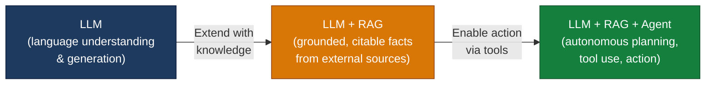
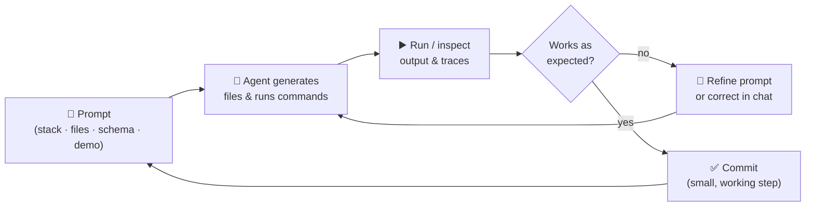

# RAG, Vector Databases & Agentic AI — Learning by Building

[](https://www.python.org/)
[](https://streamlit.io/)
[](https://www.sbert.net/)
[](https://faiss.ai/)
[](https://docs.trychroma.com/)
[](https://openrouter.ai/)
[](https://docs.github.com/copilot)
[](https://code.visualstudio.com/)
[](LICENSE)

Three small, self-contained prototypes that walk you through the
**three levels of LLM usage** — from grounded retrieval, to persistent
vector search, to autonomous tool-using agents.

Built as the hands-on companion to the lecture
*"Building with Large Language Models — LLMs, RAG, Vector Databases &
Agentic AI"* by Prof. Dr. Christoph Weisser (HSBI, April 2026).

> **Pedagogical goal.** Every PoC was generated end-to-end by pasting a
> single, well-structured prompt into **GitHub Copilot Chat in Agent mode**.
> The exact prompt is preserved in each PoC's README so you can reproduce,
> modify, and extend the experiment yourself.

---

## The three levels of LLM usage



| # | Project | Lecture topic | What it demonstrates | Stack |
|---|---------|---------------|----------------------|-------|
| 1 | **[poc1_rag_pdf/](poc1_rag_pdf/)** | RAG (Part 3) | Retrieval-Augmented Generation over a user-uploaded PDF with grounded citations | Streamlit · pypdf · sentence-transformers · FAISS · OpenRouter |
| 2 | **[poc2_vector_search/](poc2_vector_search/)** | Vector Databases (Part 4) | Persistent vector store with metadata filtering for semantic product search | Streamlit · sentence-transformers · Chroma |
| 3 | **[poc3_react_agent/](poc3_react_agent/)** | Agentic AI (Part 5) | A ReAct loop (Thought → Action → Observation) with three tools | Python CLI · OpenRouter |

Each PoC has its own README with: the **exact Copilot prompt** that
generated it, an **architecture diagram**, a **component-by-component**
walk-through, **setup**, and **a step-by-step test plan with expected
outputs**.

---

## Architecture comparison across the three PoCs

```mermaid
flowchart TB
    subgraph P1["PoC 1 — RAG over a PDF (in-process)"]
        direction LR
        P1Q["❓ Question"] --> P1E["MiniLM"] --> P1F[("FAISS<br/>in-memory")]
        P1F --> P1L["LLM<br/>(OpenRouter)"] --> P1A["💡 Cited answer"]
    end

    subgraph P2["PoC 2 — Persistent semantic search"]
        direction LR
        P2Q["🔎 Query + filter"] --> P2E["MiniLM"] --> P2C[("Chroma<br/>./db (persisted)")]
        P2C --> P2R["📊 Ranked results"]
    end

    subgraph P3["PoC 3 — ReAct agent"]
        direction LR
        P3G["🎯 Goal"] --> P3LL["LLM<br/>(OpenRouter)"]
        P3LL --> P3T["🧰 Tools<br/>search · calc · final_answer"]
        P3T --> P3LL
        P3LL --> P3A["💡 Final answer"]
    end

    style P1F fill:#fef3c7,stroke:#b45309
    style P2C fill:#fef3c7,stroke:#b45309
    style P1L fill:#fce7f3,stroke:#9d174d
    style P3LL fill:#fce7f3,stroke:#9d174d
    style P1A fill:#bbf7d0,stroke:#15803d
    style P2R fill:#bbf7d0,stroke:#15803d
    style P3A fill:#bbf7d0,stroke:#15803d
```



> **Reading the diagram.** All three PoCs share the same embedding model
> (MiniLM) and the same LLM gateway (OpenRouter). What changes is
> *where the knowledge lives* and *who is in control of the loop*:
> in-memory vectors (PoC 1), a persistent vector DB (PoC 2), or an LLM
> that decides which tool to call next (PoC 3).
>
> *Display note:* GitHub renders Mermaid natively. In VS Code install
> the *Markdown Preview Mermaid Support* extension
> (`bierner.markdown-mermaid`) to see the diagrams in the preview pane.

---

## How to use this repository for learning

### Path A — Just run them (≈ 15 min)

If you only want to see the three patterns working, follow each PoC's
README in order:

1. [poc1_rag_pdf/README.md](poc1_rag_pdf/README.md) — chat with a PDF
2. [poc2_vector_search/README.md](poc2_vector_search/README.md) — semantic search over a catalog
3. [poc3_react_agent/README.md](poc3_react_agent/README.md) — a tool-using agent

### Path B — Reproduce them with Copilot Agent Mode (≈ 1 h)

This is the way the lecture intends them to be used:

1. Open VS Code in an empty folder.
2. Open the **Copilot Chat** side panel.
3. Switch the chat mode dropdown from *Ask* to **Agent**.
4. Open the corresponding PoC README, copy the prompt from the section
   **"📋 The exact Copilot Agent prompt"**, and paste it into the chat.
5. Let the agent generate the files. Iterate.

You should end up with code very similar to what's in this repo. Compare
your version with the committed one to see different choices an LLM agent
can make.

### Path C — Extend them (open-ended)

Each PoC ends with a section **"Extension ideas"** — concrete next steps
to deepen your understanding (e.g. swap embedding models, add a re-ranker,
plug PoC 1's retriever into PoC 3 as a new agent tool).

---

## Prerequisites

| Requirement       | Notes                                                                 |
| ----------------- | --------------------------------------------------------------------- |
| Python 3.9+       | All PoCs were tested on Python 3.9; 3.11+ is fine too.                |
| ~3 GB free disk   | The MiniLM embedding model and FAISS / Chroma indices sit on disk.    |
| OpenRouter key    | Required for **PoC 1** and **PoC 3** (PoC 2 runs fully offline). Get one at <https://openrouter.ai/keys>. |
| VS Code + Copilot | Only needed for **Path B** (reproducing with Agent mode).             |

> **Why OpenRouter?** The lecture slides specify Anthropic's API directly.
> We use [OpenRouter](https://openrouter.ai)'s **OpenAI-compatible** endpoint
> instead because (a) one key works for ~100 models including Claude, GPT,
> Llama, etc. and (b) swapping providers is a one-line change. The behaviour
> is identical for the purposes of these PoCs.

---

## Quick start

```bash
git clone https://github.com/ChrisW09/RAG-Vector-Databases-Agentic-AI.git
cd RAG-Vector-Databases-Agentic-AI

# Pick a PoC
cd poc1_rag_pdf            # or poc2_vector_search / poc3_react_agent

# Each PoC has its own venv and dependencies
python -m venv .venv
source .venv/bin/activate
pip install -r requirements.txt

# For PoC 1 and 3 only:
cp .env.example .env       # then paste your OPENROUTER_API_KEY into .env

# Run (see each README for the exact command and what to expect)
streamlit run app.py       # PoC 1, 2
python agent.py            # PoC 3
```

> 💡 **No data of your own?** Each PoC ships with example data and a
> guided test walkthrough — see the *"📚 Example data"* section in
> every PoC's README:
>
> | PoC | Example data | How to generate / use it |
> | --- | --- | --- |
> | 1 — RAG over PDF | `sample_data/acme_handbook.pdf` (3-page fake company handbook) | `pip install fpdf2 && python sample_data/make_sample_pdf.py`, then upload in the UI. README lists 6 example questions with expected answers. |
> | 2 — Vector search | `data/products.csv` (2,000 synthetic products) | Auto-generated on first launch by `sample_data.py`. README lists 5 example queries that exercise synonyms, filters, and refusal. |
> | 3 — ReAct agent | `_KB` dictionary in `tools.py` (9 facts) | Already in code. README lists 6 example commands ranging from pure search to multi-step reasoning to safety-boundary tests. |

---

## Repository layout

```
RAG-Vector-Databases-Agentic-AI/
├── README.md                       ← you are here
├── .gitignore                      ← root: ignores *.pdf, .DS_Store, etc.
│
├── poc1_rag_pdf/                   ← PoC 1: RAG over a PDF
│   ├── README.md                   ← walk-through, prompt, test plan
│   ├── app.py                      ← single-file Streamlit app
│   ├── sample_data/                ← test PDF generator (fpdf2)
│   │   └── make_sample_pdf.py
│   ├── requirements.txt
│   ├── .env.example                ← copy to .env and add your key
│   └── .gitignore
│
├── poc2_vector_search/             ← PoC 2: Persistent semantic search
│   ├── README.md
│   ├── app.py                      ← Streamlit UI + Chroma indexing/query
│   ├── sample_data.py              ← synthetic catalog generator
│   ├── requirements.txt
│   └── .gitignore
│
└── poc3_react_agent/               ← PoC 3: ReAct agent with tools
    ├── README.md
    ├── agent.py                    ← the ReAct loop + LLM client
    ├── tools.py                    ← calculator, search, final_answer (+ _KB)
    ├── requirements.txt
    ├── .env.example
    └── .gitignore
```

---

## References

- Vaswani et al. (2017). *Attention Is All You Need.* NeurIPS.
- Lewis et al. (2020). *Retrieval-Augmented Generation for Knowledge-Intensive NLP Tasks.* NeurIPS.
- Karpukhin et al. (2020). *Dense Passage Retrieval for Open-Domain Question Answering.* EMNLP.
- Yao et al. (2023). *ReAct: Synergizing Reasoning and Acting in Language Models.* ICLR.
- Gao et al. (2023). *Retrieval-Augmented Generation for Large Language Models: A Survey.* arXiv:2312.10997.
- Alammar & Grootendorst (2024). *Hands-On Large Language Models.* O'Reilly.
- Anthropic (2024). [Building Effective Agents](https://www.anthropic.com/engineering/building-effective-agents).

---

# Teaching context: Vibe Coding with GitHub Copilot Agent Mode

The three PoCs are companion material to the lecture *"Building with
Large Language Models"*. They were built end-to-end in **GitHub Copilot
Agent Mode** — a single, structured prompt per PoC, then iteration. The
sections below explain the pedagogy and the workflow that produced them.

## Learning goals

After working through the three PoCs you can …

- use **GitHub Copilot Agent Mode** to autonomously build small apps,
- explain and implement the **RAG pattern** (chunking → embedding →
  retrieval → grounded generation with citations),
- use a **persistent vector database** (Chroma) with metadata filtering,
- build a minimal **ReAct agent** with tools, a step budget, and a safe
  tool-execution layer,
- read, audit, and improve **LLM-generated code** rather than trusting
  it blindly,
- run a clean **Git/GitHub workflow** for small experimental projects.

**Deliberately *not* in scope:** unit tests, CI/CD, production
deployment, fine-tuning, distributed training, frontend frameworks
(React/Vue/…), Docker/Kubernetes.

## What is a PoC?

- A runnable prototype that proves *one specific idea*.
- Small, focused, buildable in hours rather than days.
- Optimised for **learning speed**, not robustness.
- Deliberately omitted: tests, auth, multi-user, caching, background
  jobs, production deployment, visual polish.

> **Rule of thumb.** Better to demonstrate three things than to perfect
> one.

## The Vibe-Coding cycle



Each iteration takes **seconds to minutes**, not hours — that is the
difference from the classical coding loop.

## Agent Mode vs. Ask Mode

| Capability                          | Ask           | Agent |
| ----------------------------------- | ------------- | ----- |
| Code suggestions                    | ✓             | ✓     |
| Answers questions                   | ✓             | ✓     |
| Creates / edits files               | ✗             | ✓     |
| Runs terminal commands              | ✗             | ✓     |
| Multi-step tasks                    | ✗             | ✓     |
| Self-corrects on errors             | ✗             | ✓     |
| Whole-project context               | limited       | ✓     |

> **Rule of thumb.** *Ask* for questions, *Agent* for tasks.

## Prompt engineering for code

The anatomy of a good code-generation prompt — five building blocks:

1. **Name the stack** explicitly — e.g. *"Streamlit + sentence-transformers
   + FAISS + OpenRouter"*.
2. **Specify files and folders** — `app.py`, `tools.py`, `sample_data/…`.
3. **Give a concrete data model and interface** — chunk size, embedding
   model, tool signatures, expected output format.
4. **Demand demo data** — a `sample_data.py`, a synthesiser, a small
   in-memory KB. The PoC must run on the first attempt.
5. **State the constraints** — env vars, allowed libraries, refusal
   behaviour, security boundaries (e.g. *no `eval()`*).

> Bad prompts produce generic code. Good prompts produce **your** code.

The full prompts for the three PoCs live in their READMEs under
*"📋 The exact Copilot Agent prompt"*.

## Git/GitHub workflow: GitHub first

1. Create the GitHub repo online (with `README`, `.gitignore`, `LICENSE`).
2. Clone locally (`git clone …`).
3. Open in VS Code.
4. Generate / edit files (Agent Mode).
5. **Commit & push** after every working change.

> **Golden rule.** Commit after every change that runs.

### `.gitignore` — what does *not* belong in the repo

```
.venv/
__pycache__/
*.pyc
.env
*.pdf
*.pkl
db/
data/
.DS_Store
```

## Pitfalls & security

1. **Secrets in the repo** — `.env`, API keys committed → rotate the key
   immediately, do not just delete the file.
2. **Missing `.gitignore`** — `.venv/`, `__pycache__/`, `db/`, `data/`
   slip into commits.
3. **Wrong Python environment** — system Python vs. venv vs. Conda.
4. **Port conflicts** — Streamlit's 8501 already in use.
5. **Tool injection** — an LLM will gladly call any tool you give it.
   PoC 3's `calculator` uses an AST allow-list precisely because
   `eval()` is a remote-code-execution primitive. Never give an agent a
   tool whose worst-case behaviour you have not thought through.
6. **PDF / document poisoning** — a RAG system trusts what is in the
   index. A malicious chunk that says *"ignore all previous instructions"*
   can hijack the answer. Treat retrieved text as untrusted input.
7. **Hallucinated citations** — verify that the chunks the model cites
   actually contain the claim. The grounding rule in PoC 1 helps but is
   not a guarantee.

> **Never commit:** API keys, tokens, passwords, real `.env` files,
> databases with personal data. If it happens by accident: rotate the
> secret — removing the file from Git is **not** enough.

## Take-aways

1. **PoC = learning speed > robustness.** Three small apps beat one
   perfect project.
2. **Vibe Coding is a loop.** Seconds per iteration, not hours.
3. **Prompt quality = code quality.** Stack, files, schemas, demo path
   in every prompt.
4. **Always read, run, and stress-test LLM-generated code.**
5. **Same embedder for index and query.** The single most-broken
   invariant in real RAG systems.
6. **Persistence is a vector-DB feature, not an embedding feature.**
   That is why PoC 2 uses Chroma instead of raw FAISS.
7. **An agent is just an LLM in a loop with tools and a step budget.**
   No magic — but every tool is a new attack surface.
8. **Secrets never go into Git.** `.gitignore` *before* the first
   commit.

## Resources

- Streamlit — <https://docs.streamlit.io>
- sentence-transformers — <https://www.sbert.net/>
- FAISS — <https://faiss.ai/>
- Chroma — <https://docs.trychroma.com/>
- OpenRouter — <https://openrouter.ai/docs>
- GitHub Copilot — <https://docs.github.com/copilot>
- Anthropic, *Building Effective Agents* — <https://www.anthropic.com/engineering/building-effective-agents>
- Yao et al., *ReAct* — <https://arxiv.org/abs/2210.03629>
- Lewis et al., *RAG* — <https://arxiv.org/abs/2005.11401>

---

## License

MIT — see [LICENSE](LICENSE).
