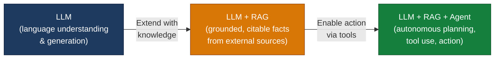

# RAG, Vector Databases & Agentic AI — Learning by Building

Three small, self-contained prototypes that walk you through the
**three levels of LLM usage** — from grounded retrieval, to persistent
vector search, to autonomous tool-using agents.

Built as the hands-on companion to the lecture
*"Building with Large Language Models — LLMs, RAG, Vector Databases &
Agentic AI"* by Prof. Dr. Christoph Weisser (HSBI / IBSEN, April 2026).

> **Pedagogical goal.** Every PoC was generated end-to-end by pasting a
> single, well-structured prompt into **GitHub Copilot Chat in Agent mode**.
> The exact prompt is preserved in each PoC's README so you can reproduce,
> modify, and extend the experiment yourself.

---

## The three levels of LLM usage



| # | Project | Lecture topic | What it demonstrates | Stack |
|---|---------|---------------|----------------------|-------|
| 1 | **[poc1_rag_pdf/](poc1_rag_pdf/)** | RAG (Part 3) | Retrieval-Augmented Generation over a user-uploaded PDF with grounded citations | Streamlit · pypdf · sentence-transformers · FAISS · OpenRouter |
| 2 | **[poc2_vector_search/](poc2_vector_search/)** | Vector Databases (Part 4) | Persistent vector store with metadata filtering for semantic product search | Streamlit · sentence-transformers · Chroma |
| 3 | **[poc3_react_agent/](poc3_react_agent/)** | Agentic AI (Part 5) | A ReAct loop (Thought → Action → Observation) with three tools | Python CLI · OpenRouter |

Each PoC has its own README with: the **exact Copilot prompt** that
generated it, an **architecture diagram**, a **component-by-component**
walk-through, **setup**, and **a step-by-step test plan with expected
outputs**.

---

## How to use this repository for learning

### Path A — Just run them (≈ 15 min)

If you only want to see the three patterns working, follow each PoC's
README in order:

1. [poc1_rag_pdf/README.md](poc1_rag_pdf/README.md) — chat with a PDF
2. [poc2_vector_search/README.md](poc2_vector_search/README.md) — semantic search over a catalog
3. [poc3_react_agent/README.md](poc3_react_agent/README.md) — a tool-using agent

### Path B — Reproduce them with Copilot Agent Mode (≈ 1 h)

This is the way the lecture intends them to be used:

1. Open VS Code in an empty folder.
2. Open the **Copilot Chat** side panel.
3. Switch the chat mode dropdown from *Ask* to **Agent**.
4. Open the corresponding PoC README, copy the prompt from the section
   **"📋 The exact Copilot Agent prompt"**, and paste it into the chat.
5. Let the agent generate the files. Iterate.

You should end up with code very similar to what's in this repo. Compare
your version with the committed one to see different choices an LLM agent
can make.

### Path C — Extend them (open-ended)

Each PoC ends with a section **"Extension ideas"** — concrete next steps
to deepen your understanding (e.g. swap embedding models, add a re-ranker,
plug PoC 1's retriever into PoC 3 as a new agent tool).

---

## Prerequisites

| Requirement       | Notes                                                                 |
| ----------------- | --------------------------------------------------------------------- |
| Python 3.10+      | All PoCs use modern type hints and dataclasses.                       |
| ~3 GB free disk   | The MiniLM embedding model and FAISS / Chroma indices sit on disk.    |
| OpenRouter key    | Required for **PoC 1** and **PoC 3** (PoC 2 runs fully offline). Get one at <https://openrouter.ai/keys>. |
| VS Code + Copilot | Only needed for **Path B** (reproducing with Agent mode).             |

> **Why OpenRouter?** The lecture slides specify Anthropic's API directly.
> We use [OpenRouter](https://openrouter.ai)'s **OpenAI-compatible** endpoint
> instead because (a) one key works for ~100 models including Claude, GPT,
> Llama, etc. and (b) swapping providers is a one-line change. The behaviour
> is identical for the purposes of these PoCs.

---

## Quick start

```bash
git clone https://github.com/ChrisW09/RAG-Vector-Databases-Agentic-AI.git
cd RAG-Vector-Databases-Agentic-AI

# Pick a PoC
cd poc1_rag_pdf            # or poc2_vector_search / poc3_react_agent

# Each PoC has its own venv and dependencies
python -m venv .venv
source .venv/bin/activate
pip install -r requirements.txt

# For PoC 1 and 3 only:
cp .env.example .env       # then paste your OPENROUTER_API_KEY into .env

# Run (see each README for the exact command and what to expect)
streamlit run app.py       # PoC 1, 2
python agent.py            # PoC 3
```

---

## Repository layout

```
RAG-Vector-Databases-Agentic-AI/
├── README.md                       ← you are here
├── .gitignore                      ← root: ignores *.pdf, .DS_Store, etc.
│
├── poc1_rag_pdf/                   ← PoC 1: RAG over a PDF
│   ├── README.md                   ← walk-through, prompt, test plan
│   ├── app.py                      ← single-file Streamlit app
│   ├── requirements.txt
│   ├── .env.example                ← copy to .env and add your key
│   └── .gitignore
│
├── poc2_vector_search/             ← PoC 2: Persistent semantic search
│   ├── README.md
│   ├── app.py                      ← Streamlit UI + Chroma indexing/query
│   ├── sample_data.py              ← synthetic catalog generator
│   ├── requirements.txt
│   └── .gitignore
│
└── poc3_react_agent/               ← PoC 3: ReAct agent with tools
    ├── README.md
    ├── agent.py                    ← the ReAct loop + LLM client
    ├── tools.py                    ← calculator, search, final_answer
    ├── requirements.txt
    ├── .env.example
    └── .gitignore
```

---

## References

- Vaswani et al. (2017). *Attention Is All You Need.* NeurIPS.
- Lewis et al. (2020). *Retrieval-Augmented Generation for Knowledge-Intensive NLP Tasks.* NeurIPS.
- Karpukhin et al. (2020). *Dense Passage Retrieval for Open-Domain Question Answering.* EMNLP.
- Yao et al. (2023). *ReAct: Synergizing Reasoning and Acting in Language Models.* ICLR.
- Gao et al. (2023). *Retrieval-Augmented Generation for Large Language Models: A Survey.* arXiv:2312.10997.
- Alammar & Grootendorst (2024). *Hands-On Large Language Models.* O'Reilly.
- Anthropic (2024). [Building Effective Agents](https://www.anthropic.com/engineering/building-effective-agents).
