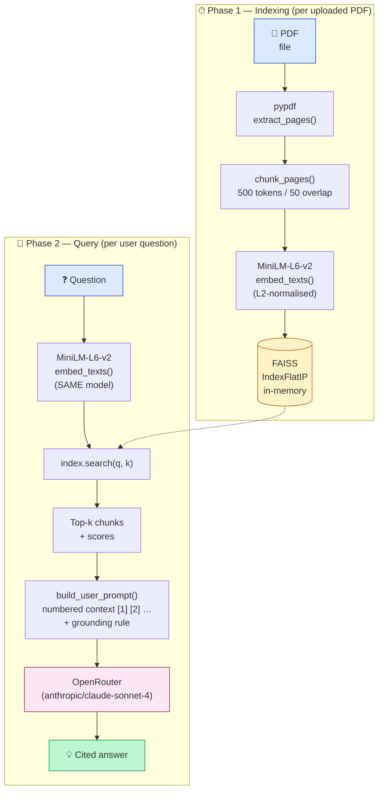
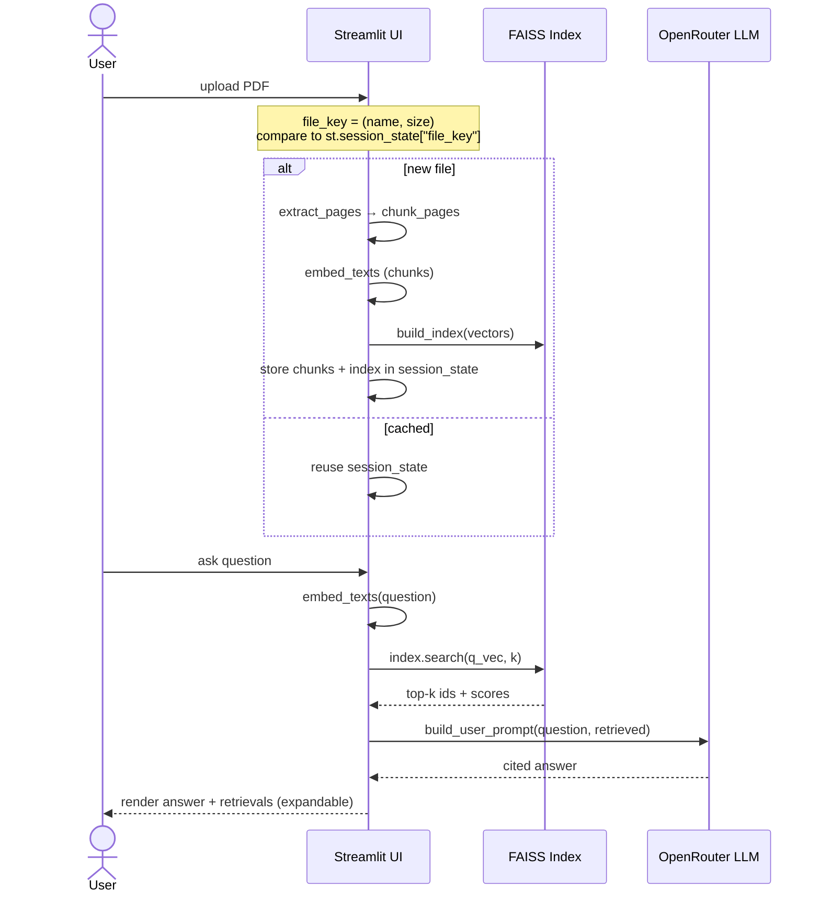

# PoC 1 — RAG over a User-Uploaded PDF

A single-file Streamlit app that lets a user **upload a PDF and ask
questions in natural language**, answered *only* from the document, with
inline citations like `[1]`, `[2]` pointing back to the supporting chunks.

This is the canonical **Retrieval-Augmented Generation** pattern:

> Standard LLM = closed book exam.
> RAG = open book exam — the model is allowed to consult the document
> before answering.

---

## 🎯 What you will learn

By reading the code and running the app, you will see, end-to-end:

1. How a PDF is **parsed** and split into overlapping **chunks**.
2. How chunks are **embedded** into vectors with `sentence-transformers`.
3. How **FAISS** stores those vectors and serves nearest-neighbour search.
4. How a **query is embedded with the same model** (the key invariant of
   RAG) and matched against the index.
5. How an **augmented prompt** is constructed to force the LLM to ground
   its answer in retrieved context and produce verifiable citations.

---

## 📋 The exact Copilot Agent prompt

This PoC was generated by pasting the following prompt into VS Code's
Copilot Chat in **Agent mode**. It is reproduced verbatim from the
lecture slides so you can paste it yourself and compare.

> **Build a single-file Streamlit app `app.py` that does Retrieval-Augmented
> Generation over a user-uploaded PDF. Use `pypdf` to extract text, split
> it into chunks of 500 tokens with 50-token overlap, embed each chunk
> with `sentence-transformers` model `all-MiniLM-L6-v2`, and store the
> vectors in an in-memory FAISS index (cosine via inner product on
> normalised embeddings). On each user question, embed the query with the
> same model, retrieve the top-`k` chunks (`k` configurable in a sidebar
> slider, default 4), build an augmented prompt that instructs the LLM to
> answer ONLY from the provided context and cite chunks as `[1]`, `[2]`,
> and call the Anthropic API (`claude-sonnet-4-6`, key from
> `ANTHROPIC_API_KEY`). Add `requirements.txt` (streamlit, pypdf,
> sentence-transformers, faiss-cpu, anthropic), a `.gitignore`
> (`.venv/`, `.env`, `*.pdf`), and a short README with the run command.**

> 📝 **Deviation from the prompt:** the committed code uses
> [OpenRouter](https://openrouter.ai)'s OpenAI-compatible endpoint
> (`anthropic/claude-sonnet-4`) rather than calling Anthropic directly,
> so a single key works for any model slug. To switch back to native
> Anthropic, replace the `OpenAI(...)` client in [app.py](app.py) with
> `anthropic.Anthropic(...)`, and the env var with `ANTHROPIC_API_KEY`.

---

## 🏗️ Architecture

The app has two phases — **indexing** (runs once per uploaded PDF) and
**querying** (runs on every question).



> **Key invariant:** the **same** embedding model encodes both the chunks
> at indexing time and the query at runtime. Mixing models breaks the
> geometry and retrieval becomes meaningless.

---

## 🧩 Components — file by file

There is exactly one source file:

### [`app.py`](app.py) — single-file Streamlit app

It is organised into five logical sections, mirroring the architecture
above. Each section is one or two functions that you can read top-to-bottom.

| Section | Functions | Responsibility | Interacts with |
| --- | --- | --- | --- |
| **Cached resources** | `load_embedder()`, `get_anthropic_client()` *(named for legacy reasons; actually returns an `OpenAI` client)* | Create heavy objects **once** per Streamlit session via `@st.cache_resource`. | Streamlit cache; env var `OPENROUTER_API_KEY`. |
| **PDF → chunks** | `extract_pages()`, `_tokenize()`, `chunk_pages()` | Read PDF bytes with `pypdf`, split each page on whitespace, slide a 500-word window with 50-word overlap. Each chunk records its source page. | Input: raw bytes from `st.file_uploader`. Output: `list[Chunk]`. |
| **Embeddings + FAISS** | `embed_texts()`, `build_index()` | Call MiniLM with `normalize_embeddings=True`, then add the resulting `float32` vectors to `faiss.IndexFlatIP` (inner product = cosine for normalised vectors). | Input: `list[str]`. Output: a populated FAISS index. |
| **Prompt + LLM call** | `SYSTEM_PROMPT`, `build_user_prompt()`, `call_anthropic()` *(also legacy name)* | Stitch the retrieved chunks into a numbered context block, add a strict grounding instruction ("answer ONLY using the context"), and send the result via `client.chat.completions.create(...)`. | Talks to OpenRouter's REST endpoint. |
| **Streamlit UI** | `main()` | Layout: title, sidebar (top-k slider, env-var warning), file uploader, question input, "Answer" button. Persists `chunks` and `index` in `st.session_state` keyed on the uploaded file. | Calls every other section. |

#### How the chunks flow through `st.session_state`



---

## ⚙️ Setup

```bash
cd poc1_rag_pdf
python -m venv .venv
source .venv/bin/activate
pip install -r requirements.txt
cp .env.example .env       # then edit .env: OPENROUTER_API_KEY=sk-or-v1-…
```

Get a free OpenRouter key at <https://openrouter.ai/keys>. Many models
(including Claude variants) have a free tier.

---

## ▶️ Run

```bash
streamlit run app.py
```

Streamlit opens a browser tab (typically <http://localhost:8501>).

---

## 🧪 Test plan

Use any PDF you have on disk. Below is a script you can follow to verify
that **all four guarantees of RAG** hold.

### Test 1 — Indexing actually happened

1. Upload a PDF (≥ 2 pages).
2. **Expected:** a green box appears: *"Indexed **N** chunks from `<file>`."*
   `N` should be roughly `total_words / 450` (since chunks are 500 words
   with 50-word overlap, the effective stride is 450).
3. Adjust the **Top-k** slider in the sidebar to `4` (default).

### Test 2 — Grounded answer

Ask a question whose answer you can verify by reading one paragraph of
the PDF, e.g. *"What does section 2 say about X?"*

- **Expected:** the answer references chunks like `[1]`, `[2]`.
- **Expected:** the *"Retrieved context"* expander shows chunks whose
  similarity scores (cosine) are ≥ ~0.4 and whose text contains the
  evidence for the answer.

### Test 3 — Refusal when retrieval is irrelevant

Ask something unrelated to the PDF, e.g. *"Who won the 2024 Super Bowl?"*

- **Expected:** the answer is something like *"I don't know based on the
  provided context."* This proves the **grounding instruction** in
  `SYSTEM_PROMPT` is doing its job.
- ❗ If the model invents a confident answer, the grounding has failed —
  see *Troubleshooting* below.

### Test 4 — Citations point to the right chunks

Pick a sentence from the answer that's followed by `[1]`. Open the
*"Retrieved context"* expander, click chunk **[1]**, and confirm the
underlying text really supports that sentence.

### Test 5 — Top-k matters

Re-ask the same question with **Top-k = 1** vs. **Top-k = 10**.

- **k = 1:** answers are tighter but fragile — if the single retrieved
  chunk is wrong, the answer will be wrong.
- **k = 10:** higher recall, but the prompt is longer (more cost / slower)
  and noisier chunks can confuse the model.

This is the central retrieval trade-off.

---

## 🛠️ Troubleshooting

| Symptom | Likely cause | Fix |
| --- | --- | --- |
| Sidebar warning *"Set OPENROUTER_API_KEY"* | `.env` not created or key not pasted. | `cp .env.example .env`, paste your key, restart Streamlit. |
| `Could not extract any text from this PDF` | The PDF is scanned (images, no text layer). | Pre-process with OCR (e.g. `ocrmypdf`) before uploading. |
| Answers ignore the document and seem invented | Grounding rule weakened by an unusual prompt or the model. | Re-read `SYSTEM_PROMPT` in [app.py](app.py); try a stronger model slug. |
| `LLM call failed: 401` | Invalid / expired OpenRouter key. | Generate a new key at <https://openrouter.ai/keys>. |
| Embedding step is very slow | First run downloads the MiniLM model (~80 MB). | Wait once; subsequent runs are cached. |

---

## 🔧 Tuning knobs

All four are constants at the top of [app.py](app.py):

```python
EMBED_MODEL_NAME = "all-MiniLM-L6-v2"          # try BAAI/bge-small-en-v1.5
LLM_MODEL        = "anthropic/claude-sonnet-4"  # any OpenRouter slug
CHUNK_TOKENS     = 500                          # 200–800 is a sweet spot
CHUNK_OVERLAP    = 50                           # 10–20 % of chunk size
```

Plus the runtime knob:

- **Top-k slider** (sidebar): how many chunks to retrieve per question.
  Default 4. Higher = better recall but more tokens.

---

## 💡 Extension ideas

- **Persist the index.** Save `index` and `chunks` to disk with
  `faiss.write_index` so re-uploading the same PDF skips embedding.
- **Per-page citations link to the PDF viewer.** Use `st.pdf` (Streamlit
  ≥ 1.36) and jump to `chunk.page` on click.
- **Re-ranker.** After top-k retrieval, re-rank with a cross-encoder
  (`cross-encoder/ms-marco-MiniLM-L-6-v2`) to boost precision.
- **Hybrid search.** Combine vector similarity with BM25 keyword
  matching (`rank_bm25`) and merge the two rankings.
- **Plug into PoC 3** (the agent) as a new `pdf_search` tool.

---

## 📂 Files in this PoC

- [app.py](app.py) — the single-file Streamlit application.
- [requirements.txt](requirements.txt) — `streamlit`, `pypdf`, `sentence-transformers`, `faiss-cpu`, `openai`, `python-dotenv`.
- [.env.example](.env.example) — copy to `.env` and add your `OPENROUTER_API_KEY`.
- [.gitignore](.gitignore) — excludes `.venv/`, `.env`, `*.pdf`.
