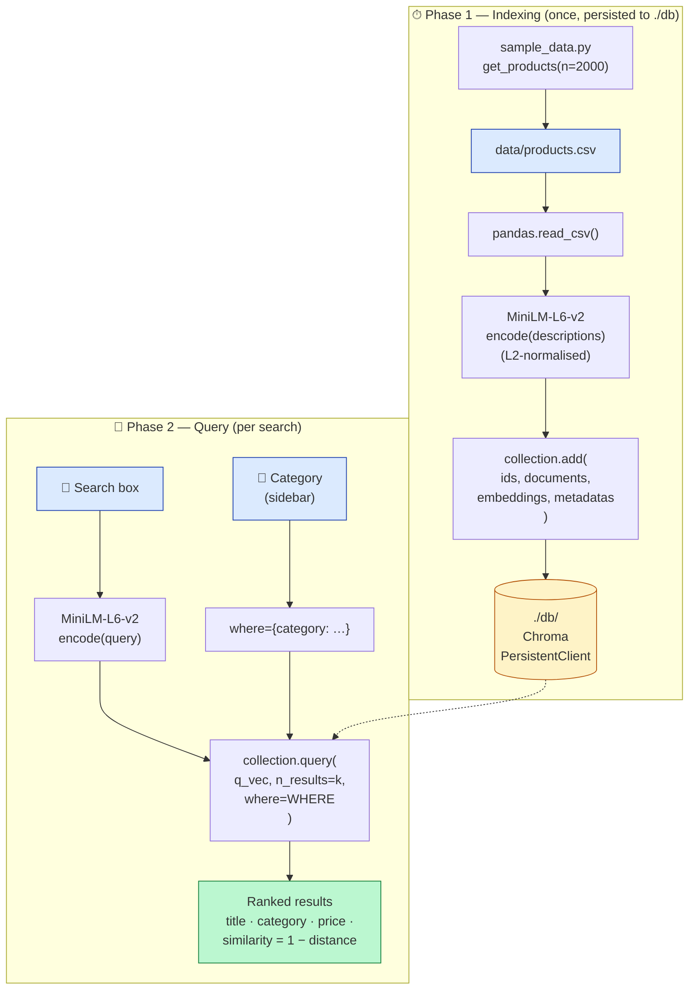
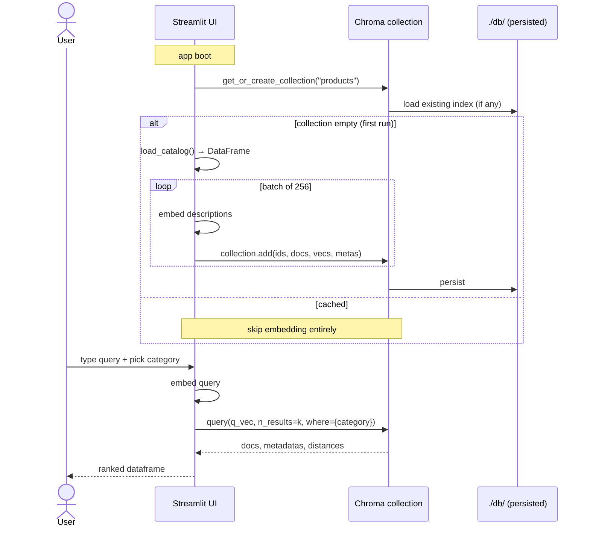

# PoC 2 — Semantic Product Search with Chroma

A Streamlit app that performs **semantic search** over a synthetic
product catalog using a **persistent** [Chroma](https://docs.trychroma.com/)
vector database. Demonstrates the difference between exact keyword
search and meaning-based retrieval — and shows how a *real* vector DB
adds **persistence** and **metadata filtering** on top of raw similarity
search.

> Where PoC 1 used FAISS as an in-process library (great for prototypes,
> no persistence, no metadata), this PoC uses a proper vector database.
> Same MiniLM embeddings; very different ergonomics.

---

## 🎯 What you will learn

By reading the code and running the app, you will see, end-to-end:

1. Why **keyword search fails** (`"cosy office sweater"` matches nothing
   literal) but **vector search succeeds** (it finds *"Soft, breathable
   hoodie perfect for the office"*).
2. How a **persistent vector store** survives restarts — embedding the
   catalog runs *once*, then every subsequent launch is instant.
3. How **metadata filtering** (`where={"category": "Apparel"}`) combines
   structured filters with semantic similarity in a single query.
4. How a **synthetic dataset** can be generated programmatically so the
   app works on first run without any external data.
5. Why **cosine similarity** is the default metric for normalised text
   embeddings (and how Chroma exposes it).

---

## 📋 The exact Copilot Agent prompt

This PoC was generated by pasting the following prompt into VS Code's
Copilot Chat in **Agent mode**. It is reproduced verbatim from the
lecture slides so you can paste it yourself and compare.

> **Build a single-file Streamlit app `app.py` that performs semantic
> search over a product catalog using Chroma as a persistent vector
> store. Create a helper `sample_data.py` with a function `get_products()`
> that generates ~2,000 synthetic products (id, title, description,
> category, price) using numpy/pandas, and writes them to
> `data/products.csv`. On startup, if the Chroma collection `products`
> (path `./db`) is empty, embed each product description with
> `sentence-transformers all-MiniLM-L6-v2` and add it with metadata
> `{category, price, title}`; otherwise reuse the persisted collection.
> The UI: a text input "Search" and a sidebar `st.selectbox` "Category"
> (with "All"). On submit, embed the query, run
> `collection.query(n_results=10, where={...})` with the category filter,
> and show a ranked table of title, category, price, and similarity
> score. Provide `requirements.txt` (streamlit, chromadb,
> sentence-transformers, pandas, numpy), `.gitignore` (`.venv/`, `db/`,
> `data/`), and a short README.**

> 📝 **Small additions in the committed code:** a *Top-k* slider, a
> *minimum similarity* threshold, and a clean column display for prices
> and similarity scores. These are obvious next iterations the agent
> can add by request.

---

## 🏗️ Architecture

The app has two phases — **indexing** (runs *once*, then is cached on
disk forever) and **querying** (runs on every search).



> **Persistence is the headline feature.** Restart the app and the
> embedding step is skipped — Chroma reloads the index from `./db/` in
> milliseconds.

---

## 🧩 Components — file by file

### [`sample_data.py`](sample_data.py) — synthetic catalog generator

Why generate data instead of bundling a CSV? To make the PoC work on
**first run with no external download**, and to let you regenerate with
different sizes (`n`) and seeds.

| Symbol | Responsibility |
| --- | --- |
| `CATEGORIES` | Five product categories with seed nouns (sweater, headphones, candle, …). |
| `ADJECTIVES`, `USE_CASES` | Vocabulary for plausible titles and descriptions. |
| `get_products(n=2000, seed=7)` | Sample one category + adjectives + use case per row, build a `(id, title, description, category, price)` DataFrame, write it to `data/products.csv`, return it. |

### [`app.py`](app.py) — Streamlit UI + Chroma integration

| Section | Functions | Responsibility |
| --- | --- | --- |
| **Cached resources** | `load_embedder()`, `get_chroma_collection()`, `load_catalog()` | Create the MiniLM model, the `PersistentClient(path="./db")`, and the cached DataFrame *once* per session. |
| **Indexing** | `index_catalog()` | Embed descriptions in batches of 256, then `collection.add(...)` with ids, docs, embeddings, and metadata. Shows a Streamlit progress bar. |
| **Streamlit UI** | `main()` | Builds the sidebar (Category selectbox, Top-k slider, similarity threshold), the search box, and the results table with `st.dataframe` (price as currency, similarity as a `ProgressColumn`). |

### How it all fits together at runtime



---

## ⚙️ Setup

```bash
cd poc2_vector_search
python -m venv .venv
source .venv/bin/activate
pip install -r requirements.txt
```

> **No API key needed.** Both the embedding model and the vector
> database run locally. This makes PoC 2 a great offline demo.

---

## ▶️ Run

```bash
streamlit run app.py
```

- The **first launch** writes `data/products.csv`, builds embeddings,
  and persists `./db/` (≈ 30–60 s).
- **Subsequent launches** reuse `./db/` and start in under a second.

To force a rebuild from scratch:

```bash
rm -rf db/ data/
streamlit run app.py
```

---

## 🧪 Test plan

Below is a script you can follow to verify all four properties — **vector
search, persistence, metadata filtering, and similarity ordering**.

### Test 1 — Vector search beats keyword search

Type:

```
cosy office sweater
```

- **Expected:** the top results include items described as *"soft"*,
  *"breathable"*, *"perfect for the office"* — many of them with no
  occurrence of the word "cosy" or "sweater" in the description.
- **Why this works:** MiniLM has learned that *cosy ≈ soft* and
  *sweater ≈ hoodie* in vector space.

### Test 2 — Persistence

1. Note the time it takes to start the first time (look at the
   "Building Chroma index" status box).
2. Stop the app (`Ctrl-C`) and re-run `streamlit run app.py`.
3. **Expected:** the status box does **not** appear, the sidebar shows
   *"Indexed items: ~2000"* immediately, and queries return instantly.
4. **Verify on disk:** `ls db/` shows the persisted Chroma files.

### Test 3 — Metadata filtering

1. Type a generic query like `present for someone`.
2. With **Category = All**, observe that results span multiple
   categories (Books, Home, Sports, …).
3. Set **Category = Sports** in the sidebar and submit again.
4. **Expected:** every row in the results table has `category = Sports`.
   The `similarity` column may drop slightly because we restricted the
   candidate pool — that's correct.

### Test 4 — Similarity threshold

1. Set **Min similarity** to `0.0` and run a vague query like `stuff`.
2. Note that low-relevance items still appear with similarities around
   0.1–0.2.
3. Raise the threshold to `0.4`.
4. **Expected:** the table shrinks to (or empties out, with a warning).
   This is the "explicit refusal" pattern in retrieval — better to show
   nothing than to show garbage.

### Test 5 — Comparison queries

Try the four queries below and inspect what comes back. Each is designed
to exercise a different aspect of semantic similarity.

| Query | What it tests |
| --- | --- |
| `something to listen to music on the go` | Synonym matching (no "music" in many descriptions). |
| `gift for a runner` | Cross-category surfacing (Sports ∪ Electronics ∪ Apparel). |
| `quiet bedroom decoration` | Category bleed (Home items dominate). |
| `noise cancelling headphones` | Where keyword and semantics agree. |

---

## 🛠️ Troubleshooting

| Symptom | Likely cause | Fix |
| --- | --- | --- |
| First launch is slow (~ 1 min) | Embedding 2,000 descriptions on CPU. | Wait. The progress bar shows you the rate. |
| `OperationalError: database is locked` | Two Streamlit processes opened the same `./db/`. | Stop one, or run them with `--server.port` to separate them and a different `DB_PATH`. |
| Sidebar still shows *"Indexed items: 0"* after a run | The CSV has more rows than the collection — re-indexing was triggered but failed half-way. | Delete `db/` and try again. |
| Embeddings download stalls | First run pulls MiniLM (~ 80 MB) from HuggingFace. | Check your network; subsequent runs are cached. |

---

## 🔧 Tuning knobs

All exposed at the top of [app.py](app.py):

```python
EMBED_MODEL_NAME = "all-MiniLM-L6-v2"   # try BAAI/bge-small-en-v1.5 for higher quality
COLLECTION_NAME  = "products"
DB_PATH          = "./db"
CSV_PATH         = Path("data/products.csv")
```

And the runtime knobs (sidebar):

- **Category** filter (`All` or one of five).
- **Top-k** results.
- **Min similarity** threshold.

To change the **distance metric**, edit `get_chroma_collection()`:

```python
metadata={"hnsw:space": "cosine"}   # or "l2", "ip"
```

---

## 💡 Extension ideas

- **Hybrid search.** Combine vector results with BM25 keyword results
  (`rank_bm25`) and merge the two rankings. This is the production
  sweet spot.
- **Domain-tuned embeddings.** Swap MiniLM for a domain-specific model
  (legal, biomedical, code) and re-build the index — observe the
  recall/precision change.
- **Real catalog.** Replace `sample_data.get_products()` with a loader
  for an actual e-commerce dataset (e.g. the
  [Amazon Reviews 2023 metadata](https://amazon-reviews-2023.github.io/)).
- **Add price filtering.** Chroma's `where={"price": {"$lte": 100}}`
  syntax already supports it — add a sidebar slider.
- **Wire it into the agent.** Expose this collection as a tool in PoC 3
  so the agent can answer *"find me a cosy sweater under $50"*.

---

## 📂 Files in this PoC

- [app.py](app.py) — the Streamlit UI and Chroma integration.
- [sample_data.py](sample_data.py) — synthetic catalog generator.
- [requirements.txt](requirements.txt) — `streamlit`, `chromadb`, `sentence-transformers`, `pandas`, `numpy`.
- [.gitignore](.gitignore) — excludes `.venv/`, `db/`, `data/`.
