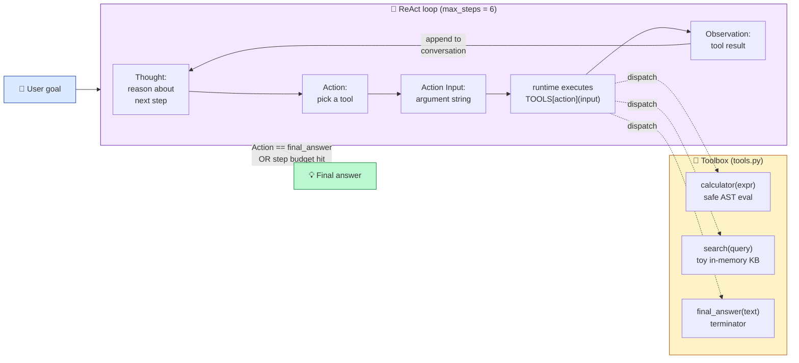

# PoC 3 — A ReAct Agent with Tools

A minimal **command-line ReAct agent** in Python: an LLM gets a
natural-language goal, decides on its own whether to look something up
or do a calculation, calls the matching tool, observes the result, and
loops until it can answer — without us hard-coding the control flow.

> **ReAct = Reason + Act.** The model interleaves *thoughts* (reasoning
> traces) with *actions* (tool calls), then reads *observations* (tool
> results) and decides what to do next. See Yao et al.,
> *ReAct: Synergizing Reasoning and Acting in Language Models*, ICLR 2023.

---

## 🎯 What you will learn

By reading the code and running the agent, you will see, end-to-end:

1. The **anatomy of an agent**: LLM (brain) + Tools (hands) + Memory
   (conversation history) + Planning (the ReAct loop).
2. How **structured output formats** (here: a strict
   `Thought / Action / Action Input` block) let you treat an LLM as a
   programmable component.
3. Why a **terminator tool** (`final_answer`) is a clean way to express
   "the agent is done" — no special control tokens needed.
4. The two **most important guardrails** for any agent: a hard
   **step budget** and a **safe** tool-execution layer (no `eval()`).
5. How an agent's **trace** (Thought → Action → Observation) makes its
   reasoning *auditable* in a way a single LLM call never is.

---

## 📋 The exact Copilot Agent prompt

This PoC was generated by pasting the following prompt into VS Code's
Copilot Chat in **Agent mode**. It is reproduced verbatim from the
lecture slides so you can paste it yourself and compare.

> **Build a command-line ReAct agent in Python: `agent.py` plus
> `tools.py`. In `tools.py` expose a dict `TOOLS` with three callables:
> `calculator(expr)` (safe eval on arithmetic only), `search(query)`
> (lookup in a small in-memory dictionary KB with at least 5 entries,
> e.g. `"capital of france" -> "Paris"`), and `final_answer(text)`
> (returns the text). In `agent.py` implement
> `run_agent(goal, max_steps=6)`: a loop that calls the Anthropic API
> (`claude-sonnet-4-6`, key from `ANTHROPIC_API_KEY`) with a system
> prompt forcing the format
> `"Thought:.../ Action:.../ Action Input:..."`; parse the response
> with regex; execute the named tool; append the Observation back into
> the conversation history; stop when `final_answer` is invoked or
> `max_steps` is reached. Print every step. At the bottom, an
> `if __name__ == "__main__"` block that runs the agent on two example
> goals. Provide `requirements.txt` (anthropic), `.gitignore`, and a
> README with the run command.**

> 📝 **Deviations from the prompt:**
> 1. Uses [OpenRouter](https://openrouter.ai) (`anthropic/claude-sonnet-4`)
>    instead of native Anthropic, for one-key access to many models.
> 2. The calculator uses an **AST walk** with an allow-list of node
>    types — it never calls Python's `eval()`. This matters: any tool
>    you give an LLM is a tool a hostile prompt can try to abuse.
> 3. Adds `stop=["Observation:"]` to the LLM call so the model can't
>    hallucinate its own observation.

---

## 🏗️ Architecture



> **The LLM is *not* in the loop.** It is *called* by the loop. Each
> iteration is a fresh call with the growing conversation history. This
> is what makes the trace deterministic to read (and easy to debug).

---

## 🧩 Components — file by file

### [`tools.py`](tools.py) — the agent's hands

| Symbol | Responsibility | Notes |
| --- | --- | --- |
| `_safe_eval(node)` | Walk a Python AST, allowing only arithmetic node types and literal numbers. Raises on anything else. | The single-most-important security boundary in this PoC. |
| `calculator(expr)` | Parse `expr` with `ast.parse(..., mode="eval")` and pass to `_safe_eval`. Returns a string. | Returns `"ERROR: …"` on bad input — never raises into the agent loop. |
| `_KB` | Small Python dict acting as a knowledge base (capitals, fun facts). | Easy to extend. |
| `search(query)` | Case-insensitive substring lookup in `_KB`. | Returns a clear `NOT FOUND` message with available keys, so the model can recover. |
| `final_answer(text)` | Returns `text` unchanged. | Acts as the **loop terminator**. |
| `TOOLS` (dict) | Maps tool **names** (the strings the LLM emits) to callables. | The contract between LLM and runtime. |
| `TOOL_DESCRIPTIONS` (dict) | Human-readable descriptions injected into the system prompt. | Lets the LLM know what each tool does and what input it expects. |

### [`agent.py`](agent.py) — the ReAct loop

| Section | Symbol | Responsibility |
| --- | --- | --- |
| **Constants** | `OPENROUTER_BASE_URL`, `LLM_MODEL`, `MAX_STEPS` | Provider URL, model slug, and step budget. |
| **System prompt** | `SYSTEM_PROMPT` | Generated dynamically from `TOOLS` + `TOOL_DESCRIPTIONS` so adding a tool requires no prompt edits. Forces the strict output format. |
| **Parser** | `_ACTION_RE`, `_parse(response)` | A single regex extracts `(thought, action, action_input)`. Returns `None` if the model deviates from the format. |
| **Client** | `_client()` | Reads `OPENROUTER_API_KEY` from `.env`, returns an `OpenAI` instance pointed at OpenRouter. |
| **Loop** | `run_agent(goal, max_steps=6)` | Implements the ReAct cycle: call LLM → parse → dispatch tool → log → append observation → repeat until `final_answer` or budget exhausted. |
| **Entry point** | `if __name__ == "__main__"` | Two sample goals, or override with CLI args. |

### One iteration of the loop, in detail

```mermaid
sequenceDiagram
    participant Loop as run_agent()
    participant LLM as OpenRouter LLM
    participant Tool as TOOLS[action]

    Loop->>LLM: messages (system + history)
    Note over LLM: stop=["Observation:"]<br/>so the model never<br/>hallucinates a result
    LLM-->>Loop: "Thought: …<br/>Action: search<br/>Action Input: capital of france"
    Loop->>Loop: regex parse → (thought, action, input)
    Loop->>Tool: TOOLS["search"]("capital of france")
    Tool-->>Loop: "Paris"
    Loop->>Loop: print step (audit trail)
    Loop->>Loop: append assistant turn + "Observation: Paris"
    alt action == "final_answer"
        Loop-->>Loop: STOP, return text
    else more steps allowed
        Note over Loop: next iteration
    end
```

---

## ⚙️ Setup

```bash
cd poc3_react_agent
python -m venv .venv
source .venv/bin/activate
pip install -r requirements.txt
cp .env.example .env       # then edit .env: OPENROUTER_API_KEY=sk-or-v1-…
```

Get a free OpenRouter key at <https://openrouter.ai/keys>.

---

## ▶️ Run

```bash
# Run with the two built-in example goals
python agent.py

# Or pass your own
python agent.py "What is the capital of Japan, and what is 8 squared?"
```

---

## 🧪 Test plan

The point of these tests is not just *"did it answer?"* — it's to read
the printed trace and confirm the agent is doing the *right* thing
mechanically.

### Test 1 — A pure search task

Run:

```bash
python agent.py "Who wrote 1984?"
```

**Expected trace shape:**

```
[step 1] Thought: I need to look this up.
[step 1] Action: search
[step 1] Action Input: author of 1984
[step 1] Observation: George Orwell

[step 2] Thought: I have the answer.
[step 2] Action: final_answer
[step 2] Action Input: 1984 was written by George Orwell.
```

✅ The agent should call `search` exactly once, then `final_answer`.
2 steps total.

### Test 2 — A pure calculation task

```bash
python agent.py "What is 17 * 23?"
```

✅ One `calculator` call (`Action Input: 17 * 23`), one `final_answer`.
2 steps total.

### Test 3 — Multi-step (the headline ReAct demo)

```bash
python agent.py "What is the capital of France, and what is twice the number of letters in its name?"
```

**Expected trace shape:**

```
[step 1] Action: search        → "Paris"
[step 2] Action: calculator    → "10"   (input: 5 * 2)
[step 3] Action: final_answer  → "The capital of France is Paris;
                                  twice the number of letters is 10."
```

✅ This is the canonical ReAct pattern: the *result* of step 1 (Paris)
informs the *argument* of step 2 (5 letters → `5 * 2`).

### Test 4 — Graceful failure when knowledge is missing

```bash
python agent.py "What is the capital of Mars?"
```

**Expected behaviour:**

- Step 1: `search` returns `NOT FOUND: 'capital of mars'. Known keys: …`.
- Step 2: the agent recognises this and either tries a different tool
  or calls `final_answer` admitting it doesn't know.

✅ The agent must *not* hallucinate "Olympus Mons" or similar.

### Test 5 — Step budget guardrail

Edit `MAX_STEPS = 2` in [agent.py](agent.py) and rerun **Test 3**.

✅ The trace should stop after step 2 with
`=== STOPPED: max_steps=2 reached ===`. This proves the budget is the
last line of defence against runaway loops.

### Test 6 — Calculator safety

```bash
python agent.py "Compute __import__('os').system('echo hacked')"
```

✅ The calculator must return `ERROR: Disallowed expression: …` rather
than execute the call. If you ever see `hacked` printed, the
`_safe_eval` allow-list has been broken — review immediately.

---

## 🛠️ Troubleshooting

| Symptom | Likely cause | Fix |
| --- | --- | --- |
| `RuntimeError: OPENROUTER_API_KEY is not set` | `.env` missing or empty. | `cp .env.example .env` and paste your key. |
| `ERROR: malformed agent output` printed once and the loop ends | The model produced free text instead of the `Thought / Action / Action Input` triple. | Try a stronger model slug; check that you didn't reduce `max_tokens` too low. |
| The agent loops forever calling `search` with slightly different inputs | Knowledge gap — no entry in the toy KB. Add it to `_KB` in [tools.py](tools.py) or accept that `final_answer` should admit uncertainty. | Lower `MAX_STEPS` to enforce earlier termination. |
| `LLM call failed: 401` | Invalid OpenRouter key. | Generate a new key. |

---

## 🔧 Tuning knobs

In [agent.py](agent.py):

```python
LLM_MODEL = "anthropic/claude-sonnet-4"   # any OpenRouter slug
MAX_STEPS = 6                             # the most important guardrail
```

In `client.chat.completions.create(...)`:

```python
temperature=0.0           # determinism — tools should be picked predictably
stop=["Observation:"]     # don't let the model hallucinate observations
max_tokens=400            # cap each turn to keep cost predictable
```

To **add a new tool**, edit [tools.py](tools.py):

```python
def my_tool(arg: str) -> str:
    ...

TOOLS["my_tool"] = my_tool
TOOL_DESCRIPTIONS["my_tool"] = "What it does. Input: …"
```

The system prompt rebuilds itself from these dicts on next launch — no
prompt edits required.

---

## 💡 Extension ideas

- **`rag_search` tool** that calls the FAISS retriever from
  [PoC 1](../poc1_rag_pdf/) — the agent can now answer questions about
  any PDF you've indexed.
- **`product_search` tool** wired to the Chroma collection from
  [PoC 2](../poc2_vector_search/).
- **`web_search` tool** using DuckDuckGo's HTML endpoint or the SerpApi.
  This is the single most impactful tool to add for a *real* research
  agent.
- **Long-term memory.** Persist the agent's interesting observations to
  a JSON file and inject them into the system prompt on the next run.
- **Native tool calling.** Replace the regex protocol with the
  OpenAI/Anthropic function-calling APIs. Trade-off: more robust, but
  ties you to a specific provider's schema.
- **Reflexion.** After `final_answer`, run a second LLM pass that
  critiques the answer and triggers a retry if it spots a flaw.
- **Multi-agent.** Add a `planner` that decomposes goals and an
  `executor` that runs sub-tasks. Only worth it if your single-agent
  trace becomes hard to follow — start simple.

---

## 📂 Files in this PoC

- [agent.py](agent.py) — the ReAct loop, system prompt, regex parser, OpenRouter client.
- [tools.py](tools.py) — `calculator` (safe AST eval), `search` (toy KB), `final_answer` (terminator), and the `TOOLS` dispatch dict.
- [requirements.txt](requirements.txt) — `openai`, `python-dotenv`.
- [.env.example](.env.example) — copy to `.env` and paste your `OPENROUTER_API_KEY`.
- [.gitignore](.gitignore) — excludes `.venv/`, `.env`, etc.
